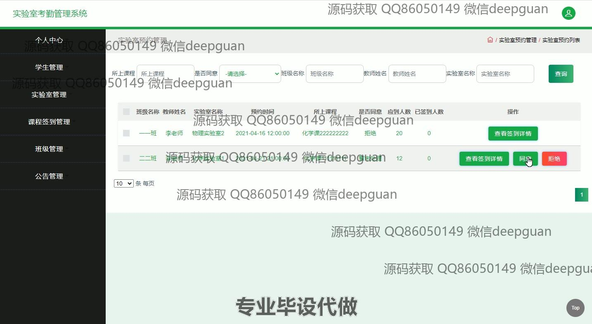
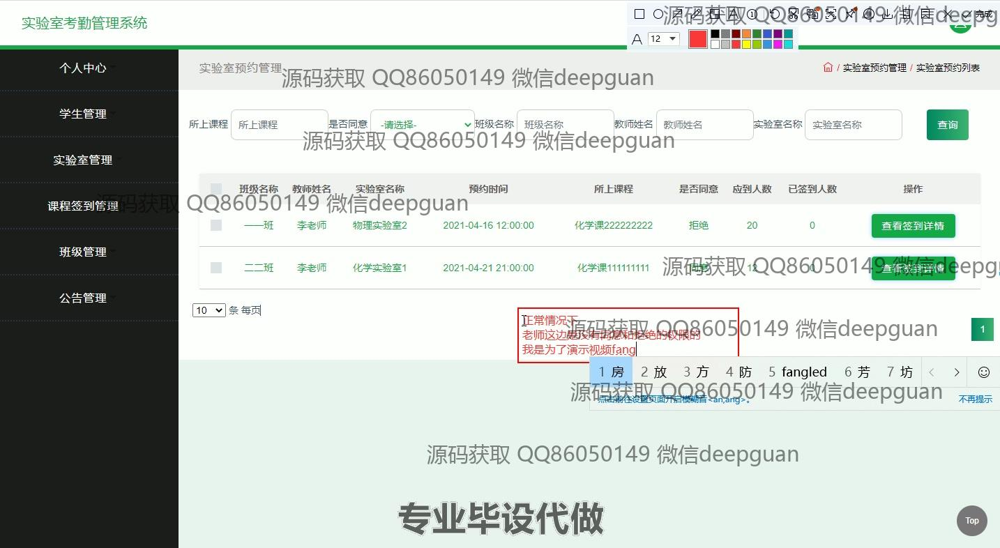
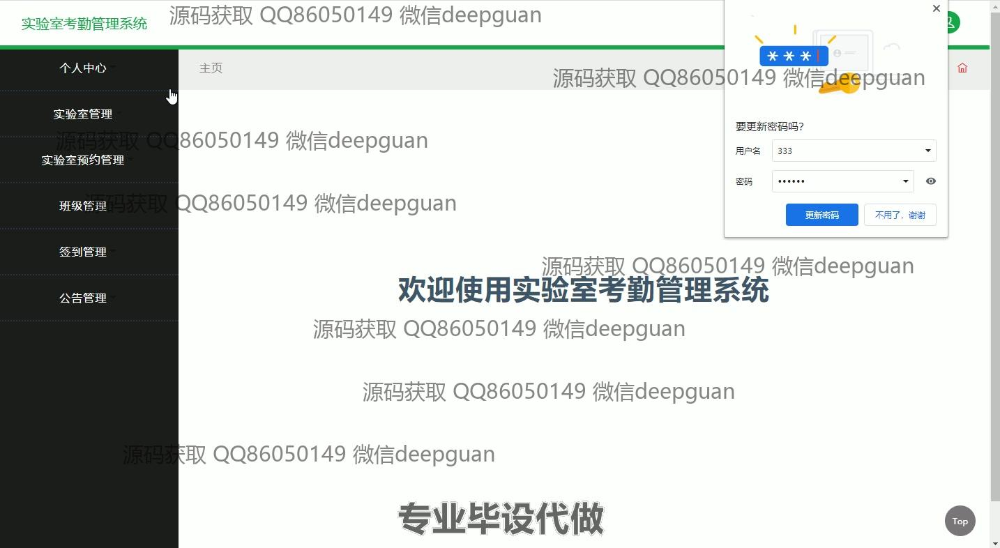

<h1 align="center">基于jsp的实验室考勤管理系统网页</h1>

## 简介
基于JSP的实验室考勤管理系统：角色分为管理员、教师、学生；包括考勤管理、用户信息管理、实验室预约管理、公告管理等功能，界面简洁明了，操作便捷。    --计算机毕业设计源码；毕设源码；java毕业设计源码

## 联系方式

<h3 align="center">获取完整代码与数据库文件 + 微信：deepguan QQ: 86050149 QQ群: 783742310</h3>

<h3 align="center">可帮忙远程部署 包运行成功！提供远程部署、修改代码、设计文档指导、代码讲解等服务！</h3>

## 功能介绍（完整见运行截图）
管理员：基本功能包括登录、注册和退出。管理员可通过导航菜单访问个人中心、管理员信息、教师管理、学生管理、实验室管理、预约管理、班级管理、签到管理和公告管理模块。可以编辑个人信息、管理教师和学生账户、处理实验室预约、发布公告，执行批量添加、删除及查询用户或资源的操作。

教师：教师用户可以登录系统，通过导航栏进入个人中心、实验室管理、课程签到管理、班级管理和公告管理。教师可更新个人信息、查看实验室可用状态、管理课程签到和班级信息、发布与查看公告。同时可以通过系统内的搜索和过滤功能查询相关数据。

学生：学生用户的功能主要集中在个人考勤和课程相关信息的查看和管理。学生可以登录后访问个人中心、学生管理、实验室信息、班级管理和签到记录。可以通过页面查看自己的签到记录、课程安排，并根据系统的筛选条件查询详细的考勤数据。

通用用户：所有用户可通过网站首页的导航查看实验室管理系统的功能模块，更新个人信息，查询考勤与预约记录，使用反馈模块进行系统疑问解答和问题反馈。界面设计简洁直观，便于各类角色执行相应任务，确保实验室考勤管理流程的透明和高效。

## 运行截图

本代码来源于网络,仅供学习参考使用!

